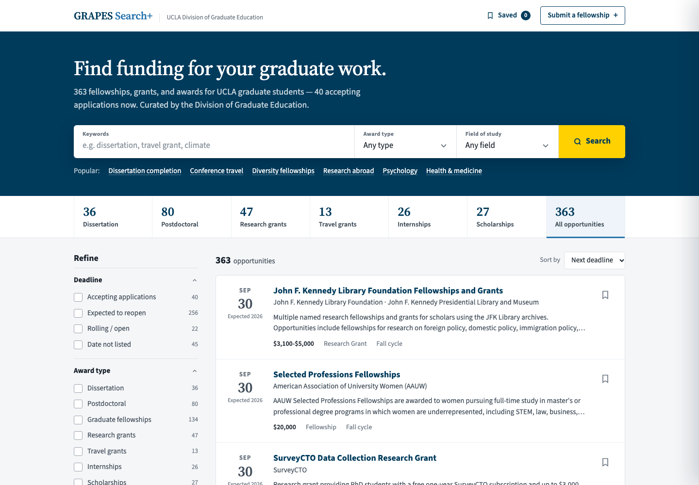

# GRAPES Search+

**Graduate fellowship, grant, and award finder for UCLA graduate students.**
Created by Daylor Williams for the UCLA Division of Graduate Education (DGE).

**[Open GRAPES Search+ →](https://daylorwilliams5.github.io/grapes-search-plus/grapes-fellowship-finder.html?v=2)**



## What it is

GRAPES Search+ is a searchable database of graduate fellowships, grants, and awards, built from the UCLA DGE GRAPES dataset. Students can search in plain language ("psychology dissertation", "conference travel") and narrow results by deadline, award type, field of study, and application season.

Listings reviewed by DGE this cycle are marked verified. The rest are shown with an "Unverified listing" note so students know to double-check the details.

## Features

- **Plain-language search.** Related terms are included automatically (for example, "psychology" also finds behavioral, cognitive, and social science awards), and matches are highlighted.
- **Filters with live counts** for deadline status, award type, field of study, application season, and verified listings.
- **Recurring deadlines.** Most awards open every year, so when a listed deadline has passed, the next one is estimated from it and labeled as an estimate instead of the listing being hidden.
- **Detail panel** for each award, with the sponsor, amount, eligibility, and a link to the official page.
- **Saved list.** Students can bookmark awards; the list is stored in their browser.
- **Shareable searches.** Keywords and filters are kept in the page address.
- **Single HTML file.** No server, login, or build step. Fonts load from Google Fonts, with system fonts as a fallback.

## Updating the data

A GitHub Actions workflow merges the latest GRAPES spreadsheet into the site at the start of each application cycle (September 1, January 1, March 15, and June 15). To use it, either commit the spreadsheet to `data/` (the newest `.xlsx` there is used) or run the workflow by hand from the **Actions** tab with a direct download link. With neither, the run does nothing.

Each run does the following:

1. **Extract** the rows from the spreadsheet's "GRAPES Updates" sheet.
2. **Merge** them into the site data:
   - Listing status (verified or unverified) follows the spreadsheet.
   - A deadline from the spreadsheet is used only if staff updated that row after the last audit, the listing's own date has passed, and the spreadsheet's date is newer. This keeps deadlines that were confirmed on sponsor sites.
   - Rows marked deleted in the spreadsheet come off the site.
   - Rows not yet on the site are saved to `data/new_from_spreadsheet.json` to be researched, rather than published without a description or link.
   - Record numbers in `data/excluded_ids.json` (programs removed as discontinued, paused, or duplicate) are never added back.
3. **Rebuild** the page and commit the changes.

Listings are never removed just because their deadline is old. The page estimates the next deadline from the last one for a year and a half, then asks students to check the sponsor's page.

To run the same steps locally:

```bash
pip install pandas openpyxl python-dateutil

python scripts/01_extract.py \
  --input "data/GRAPES AnnLog.xlsx" \
  --output data/fellowships_base.json

python scripts/03_merge_and_rebuild.py \
  --data data/fellowships_master.json \
  --base data/fellowships_base.json \
  --template grapes-fellowship-finder.html \
  --output grapes-fellowship-finder.html
```

`scripts/02_enrich.py` is a starting point for filling in descriptions, eligibility, and links for new rows from the sponsors' websites.

## Checking listings with the research agent

Instead of scraping sponsor sites, a Claude research agent can check listings and propose updates. For each listing it searches the web, reads the sponsor's pages, and reports the current deadline, award amount, eligibility, and official link. Every value must come with the page it came from and a quote copied from that page. The script then checks each quote against the page text and drops any value whose quote isn't on the page or doesn't contain the value.

Checked changes are never published directly. The **Agent Research** workflow opens a pull request with the changes and a report of the evidence, and DGE staff review and merge it. The agent only:

- moves a deadline later (never earlier),
- fills in an amount when a listing has none,
- replaces a link when the current one is broken.

It never changes a listing's verified status. Eligibility differences and programs that look discontinued are listed in the report for staff to handle.

To set it up, add an `ANTHROPIC_API_KEY` repository secret and turn on **Allow GitHub Actions to create and approve pull requests** under Settings → Actions → General. Then run **Agent Research** from the **Actions** tab. By default it checks the 20 listings whose deadlines passed most recently. Each run prints its token use and an estimated cost.

To run it locally:

```bash
pip install anthropic requests beautifulsoup4 python-dateutil pypdf
export ANTHROPIC_API_KEY=...

python scripts/02_agent_research.py --limit 5            # report only
python scripts/02_agent_research.py --ids 97,412 --apply # write changes to the data
```

The report is written to `data/agent_report.md`. Tests for the evidence checks run with `python -m pytest tests/` and don't call the API.

## Turning on "Submit a fellowship"

The page has a form for suggesting new fellowships, but its button stays hidden until it's connected to a Google Form. To turn it on, create a Google Form with fields for the link, name, notes, and extracted details, then replace `FORM_ID` and the four `entry.*` values in `GFORM_URL` and `GFORM_ENTRIES` near the end of `grapes-fellowship-finder.html`.

## Files

| File | Description |
|------|-------------|
| `grapes-fellowship-finder.html` | The app, with the data embedded. Open it in any browser. |
| `index.html` | Sends the site's root address to the app |
| `data/fellowships_master.json` | All fellowship records, including descriptions and eligibility |
| `data/excluded_ids.json` | Record numbers removed after the September 2026 audit, with reasons |
| `data/new_from_spreadsheet.json` | Spreadsheet rows waiting to be researched (written by each update) |
| `scripts/01_extract.py` | Extracts records from the DGE GRAPES spreadsheet |
| `scripts/02_enrich.py` | Template for adding descriptions and eligibility from sponsor websites |
| `scripts/02_agent_research.py` | Checks listings against sponsor sites with a research agent and proposes verified updates |
| `scripts/03_merge_and_rebuild.py` | Merges spreadsheet records into the data and rebuilds the HTML |
| `.github/workflows/update-fellowships.yml` | Scheduled update that runs the steps above |
| `.github/workflows/agent-research.yml` | Runs the research agent and opens a pull request with its changes |
| `tests/` | Tests for the research agent's evidence checks |
| `grapes-system-design.md`, `chat-system-design.md` | Design notes |

## Data source

The list of fellowships comes from the UCLA DGE GRAPES database. Descriptions, eligibility, deadlines, and official links were gathered from each sponsor's website. Students should always confirm details on the official page before applying.

---

*Built for UCLA DGE by Daylor Williams*
